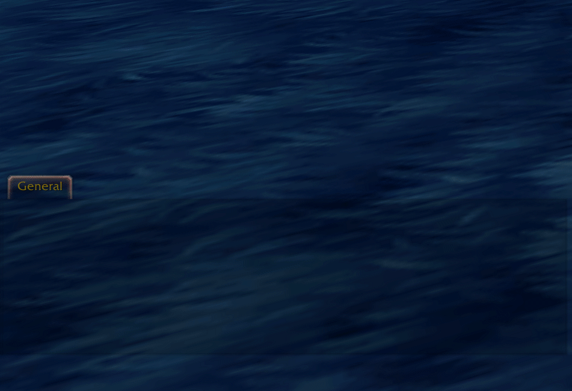

# Emojify

Modern emojis for World of Warcraft

Transform your WoW chat with static and animated emojis, smart autocomplete, 
and hundreds of emojis. Just type `:` and start expressing yourself!

Special thanks to [Arukori](https://twitch.tv/arukori) for her contributions to logo, branding, and creative direction! You made this special! 💜



## Features

- **Static & Animated Emojis** - Frame-perfect sprite animations and crisp static emojis
- **Smart Autocomplete** - Type `:` trigger with live search
- **Visual Picker** - Browse, search, and click to insert
- **Chat Bubble Support** - Works in 3D world chat bubbles (outside instances only)
- **Usage Tracking** - Frequently used emojis rise to the top
- **Keyboard Navigation** - Arrow keys + Tab for power users
- **Performance Optimized** - Only animates visible emojis

## Usage

### Quick Insert
1. Type `:` in any chat box
2. Type at least 2 characters (e.g., `:ka` for kappa)
3. Autocomplete appears with matching emojis
4. Use arrow keys to select
5. Press `Tab` to insert

**Note:** The `:` is only used to trigger autocomplete. Emoji codes themselves don't use colons (e.g., `kappa`, not `:kappa:`).

### Visual Browser
1. Hover over any chat frame
2. Click the emoji button (bottom right)
3. Search or browse by category
4. Click any emoji to send

## Installation

1. Download from CurseForge
2. Extract to `World of Warcraft\_retail_\Interface\AddOns\`
3. Restart WoW or `/reload`
4. Type `:ka` to trigger autocomplete for "kappa"

## Included Emoji Packs

- **Twitch: [Arukori](https://twitch.tv/arukori)** - Full emote collection
- **Twitch: [Hexendreieck](https://twitch.tv/hexendreieck)** - Murloc emotes
- **Twitch: [Larena5](https://twitch.tv/larena5)** - Full emote collection
- **Twitch: [MarryofBlood](https://twitch.tv/marryofblood)** - Full emote collection
- **Twitch: [Murtambil](https://twitch.tv/murtambil)** - Full emote collection
- **Twitch: [Schwowi](https://twitch.tv/schwowi)** - Full emote collection
- **Twitch: [xJeevy](https://twitch.tv/xjeevy)** - Full emote collection
- **Twitch: [Artemirs_](https://twitch.tv/artemirs_)** - Full emote collection
- **Twitch: [BroStudios_WoW](https://twitch.tv/BroStudios_WoW)** - Full emote collection
- **Twitch: [YusakiKirin](https://twitch.tv/YusakiKirin)** - Full emote collection
- **BetterTTV** - Trending community emotes
- **Dracthyr** - Official World of Warcraft Dracthyr emotes

Special thanks to these amazing streamers for allowing their emotes to be included!

### Want more emotes?
Open an issue with your emoji suggestions! We're always looking to expand the collection.

**Streamers:** Interested in having your emotes included? Feel free to reach out!

---

## Creating Custom Emoji Packs

You can create your own emoji packs using Emojify's public API!

### Pack Structure

```
Emojify_YourPackName/
├── Emojify_YourPackName.toc
├── pack.lua
├── emojis/
│   ├── smile.blp
│   └── kappa.blp
└── animated_emojis/
    └── dance.blp
```

### Example TOC File

```toc
## Interface: 110205
## Title: My Custom Emojis
## Version: 1.0
## Dependencies: Emojify
## Group: Emojify

pack.lua
```

### Example pack.lua

```lua
local addonName = ...;

-- Register your pack
local pack = Emojify:RegisterPack(addonName);

-- Add static emojis (square)
pack:AddEmoji("smile", 64);
pack:AddEmoji("kappa", 64);

-- Add static emojis (rectangular)
pack:AddEmoji("wide", 128, 64);

-- Add animated emoji with default timing (40ms per frame)
pack:AddAnimatedEmoji("dance", 30, 64);

-- Add animated emoji with custom timing
pack:AddAnimatedEmoji("wave", 20, 64)
    :SetDefaultDelay(50)           -- 50ms per frame
    :SetFrameDelay(0, 100)         -- Frame 0: 100ms
    :SetFrameDelay(10, 200);       -- Frame 10: 200ms
```

### API Reference

#### Register Pack
```lua
local pack = Emojify:RegisterPack(addonName)
```
Creates a new emoji pack. The addon name should match your folder name.

#### Add Static Emoji
```lua
-- Square emoji
pack:AddEmoji(code, size)

-- Rectangular emoji
pack:AddEmoji(code, width, height)
```
- `code` - Emoji code without colons (e.g., "smile" becomes searchable with :sm)
- `size` - Width and height in pixels for square emojis
- `width`, `height` - Dimensions for rectangular emojis

**Note:** Texture file must be located at `emojis/[code].blp`

#### Add Animated Emoji
```lua
-- Square animated emoji
pack:AddAnimatedEmoji(code, frames, size)

-- Rectangular animated emoji
pack:AddAnimatedEmoji(code, frames, width, height)
```
- `code` - Emoji code without colons
- `frames` - Number of animation frames
- `size` - Size for square emojis
- `width`, `height` - Dimensions for rectangular emojis

Returns an animation object for chaining timing methods.

**Note:** Texture must be a horizontal sprite sheet at `animated_emojis/[code].blp`

#### Animation Timing (Optional)
```lua
:SetDefaultDelay(milliseconds)
```
Sets the default delay between frames in milliseconds. Default is 40ms.

```lua
:SetFrameDelay(frameIndex, milliseconds)
```
Sets a custom delay for a specific frame. Useful for hold frames or varying timing.

### Texture Requirements

**Static Emojis:**
- Single frame BLP texture
- Power-of-2 width (16, 32, 64, etc.)
- Power-of-2 height (16, 32, 64, etc.)

**Animated Emojis:**
- Horizontal sprite sheet (all frames side-by-side)
- Power-of-2 total width
- Each frame must be the same size
- Example: 30 frames of 64x64 = 1920 pixels wide (rounds to 2048)

### Example: Complete Custom Pack

```lua
local addonName = ...;

local pack = Emojify:RegisterPack(addonName);

-- Static reactions
pack:AddEmoji("happy", 64);
pack:AddEmoji("sad", 64);
pack:AddEmoji("thinking", 64);

-- Wide banner
pack:AddEmoji("banner", 256, 64);

-- Animated with default timing
pack:AddAnimatedEmoji("bounce", 15, 64);

-- Animated with custom timing (slow start, fast end)
pack:AddAnimatedEmoji("spin", 24, 64)
    :SetDefaultDelay(50)
    :SetFrameDelay(0, 200)    -- Hold first frame
    :SetFrameDelay(1, 150)
    :SetFrameDelay(2, 100);

-- Complex animation with holds
pack:AddAnimatedEmoji("wink", 30, 64)
    :SetDefaultDelay(33)
    :SetFrameDelay(10, 500)   -- Hold wink closed
    :SetFrameDelay(29, 100);  -- Quick return
```

## Technical Details

- **Animation System**: Horizontal sprite sheets with per-frame timing
- **Autocomplete**: Substring search with usage weighting
- **Performance**: Visible animation tracking
- **Storage**: Usage statistics with exponential decay (30-day window)

## Contributing

- Found a bug? Open an issue!
- Have a feature idea? Let's discuss!
- Want to suggest emotes? We'd love to hear from you!

## License

Copyright (c) 2025 Selina Ruesch. All rights reserved.

Custom emoji packs can be created using the public API without restrictions.
